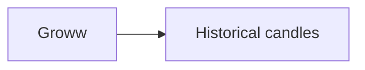
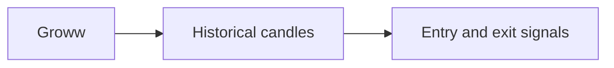
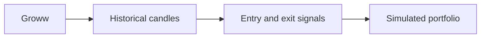

# vectorbt-groww

Test trading rules against historical Indian-stock prices using Python, Groww, and vectorbt.

A backtest asks what would have happened if you had followed a rule in the past. You choose a stock, a date range, and a strategy. This project fetches price data, simulates trades, and shows the resulting portfolio value and orders.

This is a research prototype. The stock backtest has an implemented path from data to reports, but its results still need validation. The options backtest and live trading paths have known gaps described below.

## How a stock backtest works

Groww supplies historical candles. Each candle records the opening, highest, lowest, and closing prices plus trading volume for one interval. The data loader stores fetched candles in a local SQLite cache for later runs.



A strategy reads those candles and marks when to enter or exit a trade. For example, `ma_crossover` compares the average closing price over 9 candles with the average over 21. Its backtest marks an entry when the shorter average crosses above the longer one and an exit when it crosses below. It shifts each signal to the next candle.



vectorbt combines the signals with closing prices, starting capital, and configured trading costs to simulate a portfolio. The command then prints a summary and an order log, and opens an interactive portfolio chart.



Groww handles market data and vectorbt handles the portfolio calculation. The strategy code sits between them, so you can change a trading rule without rewriting either part.

## Try a stock backtest

Clone the repository and install the dependencies in a Python environment:

```sh
git clone https://github.com/BeLazy167/vectorbt-groww.git
cd vectorbt-groww
python3 -m venv .venv
source .venv/bin/activate
pip install -r requirements.txt
cp .env.example .env
```

In `.env`, set `GROWW_API_KEY` and `GROWW_TOTP_SECRET`. The code also supports `GROWW_API_SECRET` instead of TOTP. If you use that method, add it to `.env`. You need Groww API access to fetch market data.

This example requests five-minute RELIANCE candles and simulates the moving-average strategy with ₹100,000 of starting capital:

```sh
python main.py backtest \
    --strategy ma_crossover \
    --symbol RELIANCE \
    --start 2026-01-05 \
    --end 2026-01-10 \
    --interval 5 \
    --capital 100000
```

Choose dates for which your API account can retrieve data. This command fetches data and simulates orders. It does not place real orders. The example has not been validated against the live API.

To inspect the commands without fetching market data:

```sh
python main.py --help
python main.py backtest --help
python main.py options --help
```

## Strategies and other code

The stock backtest accepts these strategy names:

| Name | Rule it explores |
| --- | --- |
| `ma_crossover` | Crossings between short and long moving averages |
| `bb_mean_reversion` | Price moves around Bollinger bands |
| `orb_rsi` | Opening-range breakouts with an RSI filter |
| `multi_confluence` | Agreement between several indicators |

The options code explores short straddles and iron butterflies. It also includes volatility calculations, screening, and model-training functions. See [OPTIONS.md](OPTIONS.md) for implementation notes. Its command examples describe intended usage, and some are unfinished.

## What needs work

- The options backtest fetches current option quotes while stepping through historical dates. Its output is not a valid historical simulation.
- The stock report calculates Sharpe using a daily frequency even for intraday candles. Its "Total Trades" field counts orders. Check these metrics before using them to compare strategies.
- The candle cache can return a partial date range without fetching the missing candles. Check that your data covers the requested period.
- Live stock trading still uses stock symbols as placeholders for exchange tokens. Backtest and live rules can also differ. For example, the live moving-average strategy adds a five-minute trend filter that its backtest omits.
- `options train` prints instructions but does not train a model. The training functions in `models/` need prepared input data.

Dependencies are unpinned. The CLI help commands have been checked. Backtests and order execution have not been validated end to end. Treat the code as a starting point for research, not evidence that a strategy makes money.

## Find the code

Start with [runner/cli.py](runner/cli.py) to follow a stock backtest. [backtesting/engine.py](backtesting/engine.py) connects the data loader, strategy, and portfolio calculation. Trading rules live in [strategies/](strategies/), and [backtesting/report.py](backtesting/report.py) produces the output.

Credentials, personal financial reports, generated charts, data caches, and Python environments stay local and are excluded from Git.

## License

[MIT](LICENSE). Dependencies retain their own licenses.
